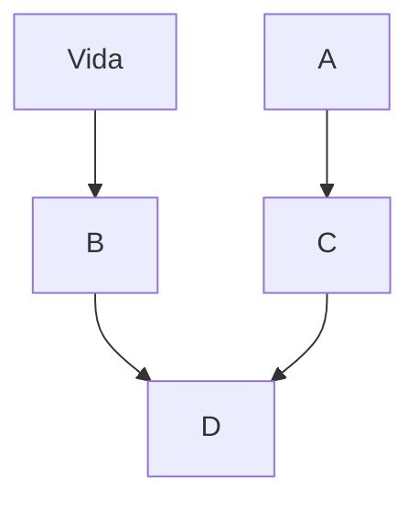

# ¿Cómo vender más?
Normalmente la expresión "vender más" hace referencia a aumentar los ingresos generados por las ventas. Esto se puede hacer de dos maneras: 
1. Aumentando el precio de venta: sin aumentar el volumen se generan más ingresos.
2. Aumentando el volumen de ventas: si se hace menteniendo el mismo precio aumentan los ingresos. Si se hace bajando el precio debe asegurarse que el porcentaje aplicado de descuento se compensa con el aumento de volumen. (Ej. Reducir el precio 10% requiere 30% más de volumen para compensar los ingresos).

Here is a simple flow chart:

